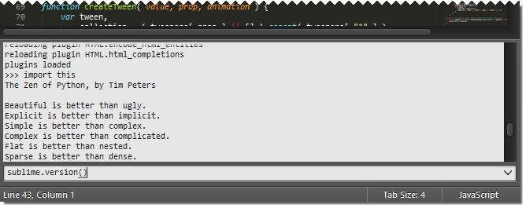
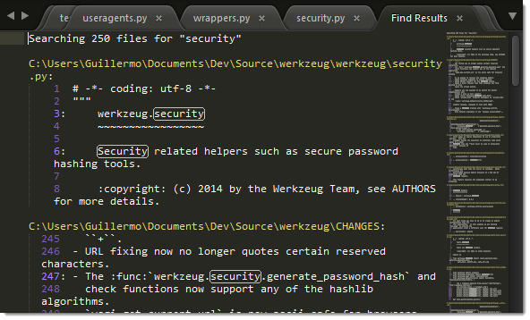
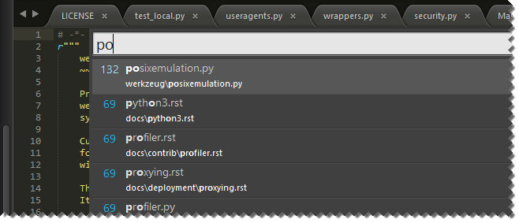
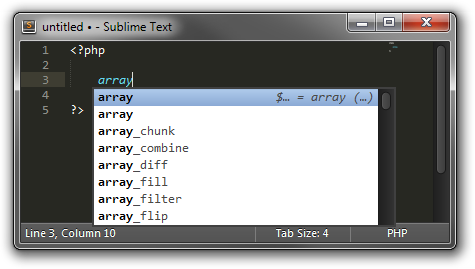
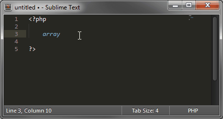
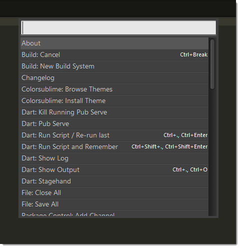

#Sublime Text非官方文档
##目录
- [关于文档](#通用)
  - [完善文档](#完善文档)
- [安装](#安装)
  - [32位和64位](#32位和64位)
  - [Windows](#windows)
  - [OS X](#os-x)
  - [Linux](#linux)
  - [发布渠道](#发布渠道)
- [基本概念](#基本概念)
  - [概述](#概述)
  - [通用惯例](#通用惯例)
  - [需要花时间来掌握Sublime Text](#需要花时间来掌握sublime-text)
  - [Data目录](#data目录)
  - [Packages目录](#packages目录)
  - [Sublime Text是可编程的](#sublime-text是可编程的)
  - [包、插件、资源和其它项](#包-插件-资源和其它项)
  - [Textmate兼容性](#textmate兼容性)
  - [vi/Vim模式](#vi-Vim模式)
  - [emacs模式](#emacs模式)
- [编辑](#编辑)
  - [概述](#概述)
  - [多文本选择](#多文本选择)
  - [多行选择合并成一行](#多行选择合并成一行)
  - [列选择](#列选择)
  - [选择文本的其它方式](#选择文本的其它方式)
  - [置换](#置换)
  - [更多...](#更多...)
- [搜索和替换](#搜索和替换)- 
  - [单文件搜索](#单文件搜索)
  - [多文件搜索](#多文件搜索)
  - [正则表达式](#正则表达式)
- [构建系统（批量处理）](#构建系统-（批量处理）)
  - [文件格式](#文件格式)
  - [构建系统存放位置](#构建系统存放位置)
  - [运行构建系统](#运行构建系统)
- [文件导航和文件管理](#文件导航和文件管理)
  - [跳转到任何位置](#跳转到任何位置)
  - [侧边栏](#侧边栏)
  - [项目](#项目)
  - [侧边栏和项目的其它设置](#侧边栏和项目的其它设置)
  - [工作空间](#工作空间)
  - [面板](#面板)
- [定制化](#定制化)
  - [设置](#设置)
  - [缩进](#缩进)
  - [按键绑定](#按键绑定)
  - [菜单](#菜单)
  - [色彩主题](#色彩主题)
- [扩展性和自动化](#扩展性和自动化)
  - [命令](#命令)
  - [宏](#宏)
  - [Snippets](#snippets)
  - [补全](#补全)
  - [命令面板](#命令面板)
  - [语法定义](#语法定义)
  - [插件](#插件)
  - [包](#包)
- [命令行](#命令行)
- [参考](#参考)
  - [语法定义](#语法定义)
  - [配色方案](#配色方案)
  - [构建系统](#构建系统)
  - [按键绑定](#按键绑定)
  - [设置](#设置)
  - [符号](#符号)
  - [注释](#注释)
  - [补全文件](#补全文件)
  - [Metadata文件](#metadata文件)
  - [命令面板](#命令面板)
  - [插件](#插件)
  - [Python API](#python-api)
  - [命令](#命令)
  - [Windows键盘快捷键](#windows键盘快捷键)
  - [OSX键盘快捷键](#osx键盘快捷键)
- [词汇表](#词汇表)

##关于文档
欢迎来到Sublime Text编辑器的非官方文档。

Sublime Text是一个可以运行在OS X、Windows和Linux上的多功能编辑器，你可以用它来写代码或是写散文.

如果你刚开始使用Sublime Text，可以先看看[基本概念](#基本概念)这部分内容。

###完善文档
如果你想帮助完善此文档，先去[GitHub](https://github.com/guillermooo/sublime-undocs)上fork仓库，本文档是用[Sphinx](http://sphinx-doc.org/)创建的。

[返回目录](#目录)

##安装
请务必阅读官网的[使用条件](http://www.sublimetext.com/buy)，它是一款收费软件。

不同平台上安装Sublime Text的方法不一样。

###32位和64位
####OS X
Sublime Text在OS X上只有一个版本，所以你可以忽略这部分。

####Windows
如果你的windows系统比较新的话就用64位的版本，运行64位出错的话就试试32位的。

####Linux
执行下面的命令查看的的操作系统类型。

```
uname -m
```
###Windows
####便捷版还是普通版
Sublime Text在Windows上有普通和便捷两个版本。除非你知道你是需要使用便捷版本，否则还是建议你安装普通版本。

**安装普通版本**会把数据存放到两个目录中：安装目录和*数据目录*（用户特定的目录，后面会解释的）。普通版本的Sublime Text也集成了文件管理器。

**安装便捷版本**会把所有文件都存放到一个目录中，即使这个文件夹被移动了位置，编辑器仍然可以正常使用。

####如何安装普通版本的Sublime Text？
1. 下载安装包
2. 双击安装包

####如何安装便捷版本的Sublime Text？
1. 下载压缩文件
2. 解压到一个文件夹
   文件夹中可以看到一个可执行的*sublime_text.exe*文件。


###OS X
1. 下载.dmg文件
2. 打开.dmg文件
3. 把Sublime Text拖动到*应用程序*文件夹中

使用下面的命令创建一个快捷方式。

```
ln -s  "/Applications/Sublime Text.app/Contents/SharedSupport/bin/subl" /usr/local/bin/subl
```
###Linux
下载安装包并且手动解压，或者你也可以使用命令解压。
####Ubuntu
#####i386

```
cd ~
wget http://c758482.r82.cf2.rackcdn.com/sublime-text_build-3047_i386.deb
```
#####x64

```
cd ~
wget http://c758482.r82.cf2.rackcdn.com/sublime-text_build-3047_amd64.deb
```
####其它版本Linux
#####i386

```
cd ~
wget http://c758482.r82.cf2.rackcdn.com/sublime_text_3_build_3047_x32.tar.bz2
tar vxjf sublime_text_3_build_3047_x32.tar.bz2
```
#####x64

```
cd ~
wget http://c758482.r82.cf2.rackcdn.com/sublime_text_3_build_3047_x64.tar.bz2
tar vxjf sublime_text_3_build_3047_x64.tar.bz2
```
现在我们应该把解压的文件移动到合适的位置。

```
sudo mv Sublime\ Text\ 3 /opt/
```
最后，用下面的命令创建一个快捷方式。

```
sudo ln -s /opt/Sublime\ Text\ 3/sublime_text /usr/bin/sublime
```
在Ubuntu下，如果你想把Sublime Text添加到统一的启动器中，那么你需要继续往下看。
首先，创建一个新文件。

```
sudo sublime /usr/share/applications/sublime.desktop
```
然后，把下面的代码粘贴到里面。

```
[Desktop Entry]
Version=1.0
Name=Sublime Text 3
# Only KDE 4 seems to use GenericName, so we reuse the KDE strings.
# From Ubuntu's language-pack-kde-XX-base packages, version 9.04-20090413.
GenericName=Text Editor

Exec=sublime
Terminal=false
Icon=/opt/Sublime Text 3/Icon/48x48/sublime_text.png
Type=Application
Categories=TextEditor;IDE;Development
X-Ayatana-Desktop-Shortcuts=NewWindow

[NewWindow Shortcut Group]
Name=New Window
Exec=sublime -n
TargetEnvironment=Unity
```
如果你已经注册过Sublime Text，但是每次打开还是提示要你注册，尝试以下命令。

```
sudo chown -R username:username /home/username/.config /sublime-text-3
```
*username*替换为你的账户名，这将修复授权错误的问题。

###发布渠道
写这个文档的时候，Sublime Text已经有了Sublime Text2和Sublime Text3两个版本，通常来说，Sublime Text3是更好的选择。尽管3还是测试版本，但是它和2一样稳定并且有更多的功能。

如果使用3遇到了问题或者你需要的一些插件或包不支持3，那么就去用2。

####获取Sublime Text3
Sublime Text3现在提供了2个发布渠道。

- [测试版](http://www.sublimetext.com/3)(默认的，推荐)
- [开发版](http://www.sublimetext.com/3dev)

比起开发版，**测试**版经过了更好的测试，在日常使用中更加可靠。**大多数用户都应该用测试版。**

*开发版*不太稳定：开发版可能会有bug，并且可能不能正常运行，更新频次也更高。

**开发版本仅供注册用户下载。**

####获取Sublime Text2
[Sublime Text2](http://www.sublimetext.com/2)

[返回目录](#目录)

##基本概念
###概述
为了充分理解本指南的余下内容，你必须非常熟悉本节内容提出的一些概念。

###通用惯例
本指南是以Windows用户的角度写的，大多数指令只需稍作变化就可以在其它平台上运行了。

如果没做其它说明，相对路径（例如，`Packages/User`）从[Data目录](#Data目录)开始。

假设键盘快捷键是默认的，如果你用的不是美式英语键盘，那么一些快捷键可能会不起作用。这是由Sublime Text内部处理按键所决定的。

###需要花时间来掌握Sublime Text
掌握Sublime Text需要时间和实践，幸运的是，它是建立在少数概念之上的，当所有部分聚集到一起形成一个统一的系统时。

本指南将教会你如何使用和配置Sublime Text。

对于程序员来说Sublime Text是一个多功能编辑器，但是你却不一定要以程序员的身份使用它，你也不必进行广泛地配置来使它进行工作。

接下来的章节中，我们将做一些概述，当你花一定的时间使用这款编辑器你就会对对它变得熟悉起来。

###Data目录
*Data目录*几乎存放了用户的所有有趣的配置文件，数据目录是基于平台定位的。

- Windows： `%APPDATA%\Sublime Text 3`
- OS X： `~/Library/Application Support/Sublime Text 3`
- Linux： `~/.config/sublime-text-3`
  如果你使用的是**便捷版本**（Windows才有），查看`Sublime Text 3/Data`。

注意`Data`目录仅仅存在于便捷版本中，正常版本的Data目录如上面说的。

###Packages目录
这是位于Data目录下的一个重要目录，所有被支持的编程和标记语言的资源都存放在这里。

你可以从主菜单访问包目录**（Preferences → Browse Packages...）**。

本指南中，我们指的packages folder是*Packages*， *packages path*，*packages folder*或*packages directory*。

####用户包
`Packages/User`包含了用户自定义的插件、片段、宏等等，可以把它理解为包目录下你的私人空间，更新Sublime Text并不会覆盖`Packages/User`。

###Sublime Text是可编程的
这个消息对程序员非常有用，其它用户只需要知道Sublime Text允许用户通过编程来给Sublime Text添加他们自己的功能。

Sublime Text通过一个应用程序编程接口（API）把它的内部暴露出来了，所以用户可以通过Python进行编程。编辑器中包含了一个嵌入式Python解释器，这个解释器对于检查编辑器的设置和开发插件时进行API测试非常有用。

Sublime Text和插件输出信息到*控制台*中，按住`Ctrl+～`或者从主菜单选择**View → Show Console**来打开控制台。

这里是Sublime Text中Python的控制台。



####系统Python VS Sublime Text 3内嵌Python
Sublime Text 3内嵌Python解释器和你的系统中的Python解释器是独立的。

内嵌Python解释器仅仅可以用来和插件API进行交互，不能用于其它开发。

###包、插件、资源和其它项
Sublime Text中几乎所有的东西都可以被扩展和自定义，你可以编辑编辑器的行为，添加宏或是代码片段，扩展菜单栏及其它更多的操作，你甚至可以通过编辑器的API开发一个全新的功能作为插件。

Sublime Text夸张的灵活性导致你必须学习很多的配置文件。

Sublime Text的配置文件必须是符合特定结构或格式的文本文件：主要是JSON文件，但是你也可以看到XML文件，对于更高级的扩展选项则是用Python文件。

本指南中，为了简便，把所有的配置文件统称为*资源文件*。

Sublime Text会在包目录下找资源文件，

###Textmate兼容性
这部分内容对从Textmate（Mac下的一款编辑器）切换到Sublime Text的用户来说很有用。

除了命令之外，Sublime Text和Textmate有着良好的兼容性。此外，Sublime Text要求所有的语法定义有一个*.tmLanguage*扩展，所有的偏好文件有*.tmPreferences extension*扩展。特别地，*.plist*文件将被忽略，即使它处于*Syntaxes*或*Preferences*子目录下。

###vi/Vim模式
这部分内容对从Vim切换到Sublime Text的用户来说很有用。

vi是一个古老的模态编辑器，允许户只能通过键盘进行所有的操作。Vim是一个现代版的vi，仍然被广泛地使用着。

Sublime Text提供了一个*Vintage*包来模拟vi，*Vintage*包默认是被忽略的，官网了解更多[Vintage](http://www.sublimetext.com/docs/3/vintage.html)的内容。

[Vintageous](http://guillermooo.bitbucket.org/Vintageous)（一个开源项目）是Vintage演化而来的，提供了更好的vi/Vim体验，更新也比Vintage更快。

###emacs模式
这部分内容对从emacs切换到Sublime Text的用户来说很有用。

emacs是程序员的另一款编辑器。

Sublime Text不提供模拟emacs的包，但是你可以用其它用户开发的第三方包。

[返回目录](#目录)

##编辑
###概述
Sublime Text有非常多的编辑功能，这里只能介绍一点皮毛。

###多文本选择
多文本选择让你高效地修改文本，任何的赞美都无法形容它了，原因：

选择一些文本，按下`Ctrl+D`进行**多选**，如果想跳过当前项，按下`Ctrl+K,Ctrl+D`。

误选了按`Ctrl+U`撤销最后一次选中项。

###多行选择合并成一行
`Ctrl+L`选中单行文本，`Ctrl+Shift+L`把多行选择变成单行选择的编辑状态。

###列选择
你可以选择文件中的一个矩形区域，这会用到多文本选择。

####使用鼠标
Windows

| 选择块    | 右击+`⇧`        |
| ------ | ------------- |
| 添加到选择  | `Ctrl`+右击+`⇧` |
| 从选择中移除 | `Alt`+右击+`⇧`  |

Linux

| 选择块    | 右击+`⇧`        |
| ------ | ------------- |
| 添加到选择  | `Ctrl`+右击+`⇧` |
| 从选择中移除 | `Alt`+右击+`⇧`  |

OSX

| 选择块    | 右击+`⌥`         |
| ------ | -------------- |
| 添加到选择  | `⌘`+右击+`⇧`     |
| 从选择中移除 | `⌘`+`⇧`+右击+`⇧` |

####使用键盘
| Windows | Ctrl + Alt + Up/Down |
| ------: | -------------------- |
|   Linux | Alt + `⇧` + Up/Down  |
|    OS X | `⌃` + `⇧` + Up/Down  |

###选择文本的其它方式
所有的选项都可以在**Selection**菜单处找到，列出一部分：

- 选择单词（`Alt + Shift + <arrow>`）
- 选择到括号（`Ctrl + Shift + M`）
- 选择到缩进（`Ctrl + Shift + J`）
- 选择到作用域（`Ctrl + Shift + Space`）

###置换
`Ctrl+T`用来置换选中的两块内容。

###更多...
**Edit、Selection、Find和Goto**菜单里面有很多编辑功能，大多数时候你只会用到其中的一部分，其它部分只会在你有需要的时候才会用到。

[返回目录](#目录)

##搜索和替换
Sublime Text提供两种主要搜索方式：

- 单文件搜索
- 多文件搜索

两种方式都支持正则表达式。

###单文件搜索
####搜索
键盘快捷键与搜索面板对应关系：

| 打开搜索面板 | Ctrl + F      |
| ------ | ------------- |
| 正则表达式  | Alt + R       |
| 大小写匹配  | Alt + C       |
| 精确匹配   | Alt + W       |
| 下一个    | Enter         |
| 上一个    | Shift + Enter |
| 所有     | Alt + Enter   |

####增量搜索
键盘快捷键与增量搜索面板对应关系：

| 打开增量搜索面板 | Ctrl + I      |
| -------- | ------------- |
| 正则表达式    | Alt + R       |
| 大小写匹配    | Alt + C       |
| 精确匹配     | Alt + W       |
| 下一个      | Enter         |
| 上一个      | Shift + Enter |
| 所有       | Alt + Enter   |

增量搜索面板和普通搜索面板的唯一区别就在于`Enter`键的行为不同，增量搜索中，按下`Enter`键后会选中下一个匹配项并直接关闭搜索面板，到底用哪一种搜索形式见仁见智。

####替换文本
键盘快捷键与替换面板对应关系：

| 打开替换面板 | Ctrl + H           |
| ------ | ------------------ |
| 下一个    | Ctrl + Shift + H   |
| 所有     | Ctrl + Alt + Enter |

####小技巧
#####其它搜索方式
[跳转到任何位置](#跳转到任何位置)提供了`#`操作符在当前文件中进行搜索。

#####其它和搜索有关的按键
下面这些按键只有在搜索面板隐藏时才有用

| 向前搜索最近匹配的搜索项 | F3         |
| ------------ | ---------- |
| 向后搜索最近匹配的搜索项 | Shift + F3 |
| 选择所有匹配项      | Alt + F3   |

你还可以基于当前的选择进行搜索

| 搜索当前选中内容 | Ctrl + E         |
| -------- | ---------------- |
| 替换当前选中内容 | Ctrl + Shift + E |

#####多行搜索
你可以在搜索面板输入多行匹配式，`Ctrl+Enter`换行。


注：搜索面板是可以调整大小的。

###多文件搜索
####搜索
键盘快捷键与搜索文件对应关系：

| 打开搜索面板 | Ctrl + Shift + F |
| ------ | ---------------- |
| 正则表达式  | Alt + R          |
| 大小写匹配  | Alt + C          |
| 精确匹配   | Alt + W          |
| 下一个    | Enter            |

####搜索作用域
**where**限制了搜索的范围，你可以通过下面的一些方法来定义范围：

- 添加单个目录（即使在windows上，也使用Unix风格的路径）
- 使用通配符添加/排除文件
- 点击右侧选择按钮（`<open folders>`，`<open files>`...）

可以用逗号分隔多个过滤条件，例如：


####结果格式
你可以自定义搜索结果的展示形式，这里有一些可选项：

- 在单独的视图中展示
- 显示上下文



####导航结果
如果搜索到匹配项，可以用下面的按键来切换搜索结果。

| 下一个  | F4         |
| ---- | ---------- |
| 上一个  | Shift + F4 |


###正则表达式
正则表达式不做介绍了，直接看图：


[返回目录](#目录)

##构建系统（批量处理）
> [构建系统的参考](#构建系统)，这里包含了可选参数、变量等的完整参考文档。


> 注意：构建系统目前正处于开发版本重做状态，以下的信息可能过时。
> 到[论坛](http://www.sublimetext.com/forum/viewtopic.php?f=2&t=17471&sid=81fd17a6c886e151a3f69c0eaa87272d)查看更多信息。

构建系统让你可以通过外部程序运行你的文件，如整理、翻译等等。

可执行的构建系统必须处于*PATH*下。

###文件格式
带有`.sublime-build`扩展名的JSON文件。

####示例

```
{
    "cmd": ["python", "-u", "$file"],
    "file_regex": "^[ ]*File \"(...*?)\", line ([0-9]*)",
    "selector": "source.python"
}
```
**cmd**

必须，这里包含了真正需要执行的命令：

	python -u /path/to/current/file.ext
​	
**file_regex**

一个Perl风格的正则表达式捕获从外部程序的输出的错误信息。

**selector**

如果设置了**Tools | Build System | Automatic** ，Sublime Text会通过匹配的`selector`自动为当前文件找到编译系统。

除了配置选项，你也可以用一些变量，例如上面用到的`$file`。

###构建系统存放位置
必须存储在Packages文件夹下（例如*Packages/User*），很多的包都包含它们独自的构建系统。

###运行构建系统
按下`F7`键或**Tools | Build**。

[返回目录](#目录)

##文件导航和文件管理
###跳转到任何位置
这个功能可以非常便捷地对你的项目文件进行导航。


键盘快捷键对应关系：

| 打开功能                | Ctrl + P |
| ------------------- | -------- |
| 选择当前项并关闭Go Anything | Enter    |
| 选择当前项               | →        |
| 关闭Go Anything       | Esc      |

当你在Go Anything输入框中输入文字时，Sublime Text就会在当前项目中进行搜索，最匹配的结果会有一个预览。这个预览只是*短暂*的，除非你对这个预览文件进行了一些操作。其它情况你也会获取一个短暂的预览视图，比如点击了左侧文件。

####运算符
你也可以使用一些操作符，注：这些操作符都可以单独使用，也可以跟在搜索项后面。例：

```
models:100
```
先搜索models，然后跳转到第100行。

#####支持的操作符
**@symbol**

符号跳转：输入@symbol跳转到symbol符号所在的位置

**#term**

关键字跳转：输入#term跳转到term所在的位置

**:line_number**

行号跳转：输入:111，跳转到111行，如果行号太大则跳转到文件最后一行。

键盘快捷键对应关系：

| @    | Ctrl + R |
| ---- | -------- |
| #    | Ctrl + ; |
| :    | Ctrl + G |


###侧边栏
不论项目是展开还是收起状态，侧边栏总是会有一个激活项目，这样就可以进行项目内检索了。

键盘快捷键对应关系：

| 切换侧边栏          | Ctrl + K, Ctrl + B |
| -------------- | ------------------ |
| 聚焦侧边栏          | Ctrl + 0           |
| 导航侧边栏          | 箭头                 |
| 退出聚焦侧边栏，重新聚焦视图 | Esc                |

###项目
项目组会让你的工作更有组织，总是会有一个激活项目存在，如果没有的话，Sublime Text会默认创建一个隐式的项目。

切换项目快捷键`Ctrl + Alt + P`。

项目的metadata存储在一个扩展名为`.sublime-project`的JSON文件中，不管有没有`.sublime-project`文件，你都可以看到`.sublime-workspace`文件（Sublime Text会用到，你无法编辑它）。

有关项目的[官方文档](http://www.sublimetext.com/docs/2/projects.html)。

####`.sublime-project`格式

```
{
    "folders":
    [
        {
            "path": "src",
            "folder_exclude_patterns": ["backup"]
        },
        {
            "path": "docs",
            "name": "Documentation",
            "file_exclude_patterns": ["*.css"]
        }
    ],
    "settings":
    {
        "tab_size": 8
    },
    "build_systems":
    [
        {
            "name": "List",
            "cmd": ["ls"]
        }
    ]
}
```
**folders**：包含的文件夹。

`path`
必须，相对于项目的相对路径，或是绝对路径。

`name`
可选，如果存在，则会出现在侧边栏。

`folder_exclude_patterns`
可选，通配符组成的列表，匹配到的文件夹会被排除在项目外。

`folder_include_patterns`
可选，通配符组成的列表，匹配到的文件夹会被包含在项目中。

`file_exclude_patterns`
可选，通配符组成的列表，匹配到的文件会被排除在项目外。

`file_include_patterns`
可选，通配符组成的列表，匹配到的文件会被包含在项目中。

**settings**：个性化设置。

只会在当前项目中生效的设置，这个会覆盖用户设置。

除了全局设置外，几乎所有的设置都可以被覆盖。

**build_systems**：构建系统。

在`.sublime-project`中你可以定义项目的构建系统，`name`必须唯一，可以在**Tools → Build Systems**菜单看到设置的构建系统。

###侧边栏和项目的其它设置
**binary_file_patterns**

通配符组成的列表，匹配到的文件会被展示到侧边栏，但是会被排除在Go Aythings之外。

###工作空间
工作空间可以看作是在同一个项目中不同的视图，例如，在做某些功能时你可能只想打开部分文件，或者在写测试时你需要不同的布局，工作空间的存在就是为了解决这个问题。

工作空间的操作和项目非常类似，创建：**Project → New Workspace for Project**，保存：**Project → Save Workspace As**。

切换工作空间`Ctrl + Alt + P`。

工作空间的metadata存储在一个扩展名为`.sublime-workspace`的JSON文件中。

###面板
视图组，可以同时打开多个面板。

键盘快捷键对应关系：

| 打开新面板  | Ctrl+K, Ctrl+↑ |
| ------ | -------------- |
| 关闭当前面板 | Ctrl+K, Ctrl+↓ |

更多面板管理看菜单栏**View → Layout**。

[返回目录](#目录)

##定制化
###设置
Sublime Text把配置文件存放在* .sublime-settings*中。

小经验：总是把个人配置文件放到*Packages/User*下，保证它们会优先于其它任何有冲突的配置文件。

####格式
带有*.sublime-settings*扩展名的JSON文件。

####设置的类型
*.sublime-settings*文件的名字决定了它的目的，名字可以是具有描述性的或是和它们所控制的内容相关的。例如，文件类型设置需要携带*.tmLanguage*定义文件类型的名字。因此，*.py*类型文件的语法定义就必须包含在`Python.tmLanguage`文件中，相应的设置文件被成为`Python.sublime-settings`。

然而，一些设置文件只在特殊的平台上生效，这可以通过文件名来推断。例如，`Preferences (platform).sublime-settings`。平台的有效名称是`Windows`、`Linux`、`OSX`。

这一点**非常重要**：`Packages/User`下面基于平台的设置文件会被忽略，这种情况下，你可以确定一个单独的文件可以覆盖其它设置。

设置的改变是时时的，但是你也许需要重启Sublime Text来加载新的设置文件。

####如何访问和编辑基本设置文件
可以通过菜单栏的**Preferences | Settings - User**和**Preferences | Settings - More**来访问主要的配置文件（除非你需要设置非常细粒度的控制，否则还是不要修改这个）。不鼓励修改**Preferences | Settings - Default **，因为每次更新软件这个文件都会恢复。然而，你可以把它当作一个参考文档：它包含了所有可用的全局和文件类型设置的解释。

####`.sublime-settings`文件优先级顺序
相同的设置文件（例如`Python.sublime-settings`）可以出现在多个地方，在具有相同名称文件中定义的所有设置将根据预定义的规则进行合并和覆盖。到[这里](#包)查看详细。

`Packages/User`下的设置文件最终都会覆盖其它同名文件的设置内容。

除了设置文件之外，Sublime Text维护*会话*数据——为当前正在被编辑的特定文件集进行设置。当你工作在一些文件时，会话数据会被更新，因此如果你以任何形式（主要是通过API调用）调整特殊文件的设置，它将会被记录在会话中，这将优先于任何可适用*.sublime-setting*文件。

要检查一个正在被编辑的特定文件的设置，在控制台输入`view.settings().get("setting_name")`。

最后，值得注意的是一些设置会自动为你进行调整。如果你对一些设置的值有困惑时，请牢记这一点。例如，这是一个有关空白设置和`syntax`设置的例子。

下面，你可以看到在Windows下Sublime Text对Python文件进行处理的一个假想层级设置的顺序。

- Packages/Default/Preferences.sublime-settings
- Packages/Default/Preferences (Windows).sublime-settings
- Packages/User/Preferences.sublime-settings
- Packages/Python/Python.sublime-settings
- Packages/User/Python.sublime-settings
- 当前文件的会话数据
- 自动调整设置

[设置的层次结构](#设置的层次结构)查看完整示例。

####全局编辑器设置和全局文件设置
这些设置被存放在`Preferences.sublime-settings`和`Preferences (platform).sublime-settings`文件中，默认设置在`Packages/Default`下。

平台的有效名称是`Windows`、`Linux`、`OSX`。

####文件类型设置
以语法定义来命名`.sublime-settings`文件，例如，语法定义为`Python.tmLanguage`，设置文件命名为*Python.sublime-settings*。

和全局设置一样，你也可以对文件类型创建指定平台的设置，例如，`Python (Linux).sublime-settings`只会作用于Linux。

此外，我们强调`Pakages/User`下只有`Python.sublime-settings`会被读到。

无论它的位置在哪里，特殊设置都会有一个较高的优先级，高于全局设置。

####设置的层次结构
下面，你可以看到在Windows下Sublime Text对Python文件进行处理的一个假想层级设置的顺序。

- `Packages/Default/Preferences.sublime-settings`
- `Packages/Default/Preferences (Windows).sublime-settings`
- `Packages/AnyOtherPackage/Preferences.sublime-settings`
- `Packages/AnyOtherPackage/Preferences (Windows).sublime-settings`
- `Packages/User/Preferences.sublime-settings`
- 项目中的设置
- `Packages/Python/Python.sublime-settings`
- `Packages/Python/Python (Windows).sublime-settings`
- `Packages/User/Python.sublime-settings`
- 当前文件的会话数据
- 自动调整设置

####存放用户设置
当你想在软件更新时保留你的设置，把对应的*.sublime-settings*文件放到`Packages/User`下。

###缩进
> [官方文档](http://www.sublimetext.com/docs/2/indentation.html)

###按键绑定
####文件格式
`.sublime-keymap`为扩展名的JSON文件中。

例如：
```
[
   { "keys": ["ctrl+shift+n"], "command": "new_window" },
   { "keys": ["ctrl+o"], "command": "prompt_open_file" }
]
```
####定义和重写按键绑定
默认：`Packages/Default/Default (Windows).sublime-keymap)`。如果你想覆盖的话，需要新建一个具有更高优先级的设置文件，例如：`Packages/User/Default (Windows).sublime-keymap`。

####高级按键绑定
简单按键绑定包括映射到一个命令的一个或多个键的序列，然而还有更加复杂的语法，例如给命令传递一些参数，限制特定上下文的按键绑定。

#####传递参数
使用`args`指定参数：

```
{ "keys": ["shift+enter"], "command": "insert", "args": {"characters": "\n"} }
```
这里，当按下`Shift+Enter`时，`insert`命令会加上`\n`参数。

#####上下文
上下文决定了一个给定的按键绑定是否生效。

```
{ "keys": ["escape"], "command": "clear_fields", "context":
   [
      { "key": "has_next_field", "operator": "equal", "operand": true }
   ]
}
```
同样的按键可能会被映射到其它上下文中，所以同样的按键可能产生不一样的结果。

#####Key Chords（同时按两个键）
你可以用多个按键组合创建一个按键绑定。

```
{ "keys": ["ctrl+k", "ctrl+v"], "command": "paste_from_history" }
```
这里，触发`paste_from_history`命令，必须先按下`Ctrl + K`，然后松开`K`，按下`V`。

注：这是一个默认的按键行为，你可以随时尝试。

###菜单
无

###色彩主题
Sublime Text默认的Python高亮配色主题：


> [配色方案](#配色方案)参考。

[返回目录](#目录)

##扩展性和自动化
下面的章节展示了Sublime Text各种各样被扩展的附加功能。

###指令
Sublime Text中指令是无处不在的：按键绑定、菜单项、宏等都可以通过指令来工作。
有些指令是在Sublime Text编辑器的核心实现的，但是他们当中的很多都是作为Python插件，每一个指令都可以由一个通过Python插件来调用。

####指令调度
通常情况，指令是被绑定到应用程序对象、一个窗口对象或是一个视图对象中。但是，窗口对象会根据输入的焦点来调度指令，所以你可以从一个窗口对象发送一个视图指令，它会为你找到正确的视图实例。

####指令解析
指令都是以`_`分隔的名称，如：`hot_key`，它可以跟一个字典参数（key是string类型，value是JSON类型）。下面是几个从Python控制台运行的指令：
```
view.run_command("goto_line", {"line": 10})
view.run_command('insert_snippet', {"contents": "<$SELECTION>"})
view.window().run_command("prompt_select_project")
```
> [指令](#指令)参考。

###宏
宏是包含一个指令队列的自动化工具，可以用它来完成一些重复性工作。

宏文件是以`.sublime-macro`为扩展名的JSON文件，Sublime Text自带了几个提供核心功能的宏命令，如行和词的删除。你可以在**工具 | Macros**或是`Packages/Default`中找到它们。

####如何录制宏
按下`Ctrl+q`，然后依次执行所需的命令。当操作完成时，再次按下`Ctrl+q`结束宏的录制。新创建的宏不会保存成一个文件，只会保留在宏缓冲区中。现在你可以通过按下`Ctrl+Shift+q`来运行这个宏，或者执行**工具 | 保存宏**把它保存到一个文件中。

注意：宏缓冲区只会保留最新记录的宏，宏只会记录发送到缓冲区的命令：窗口级别的指令将会被忽视，如创建文件。

####如何编辑宏
录制宏的另外一个选择就是手动编辑它，在`Packages/User`下创建一个以`.sublime-macro`为扩展名的文件，这个文件中写入操作指令。宏文件格式如下：
```
[
    {"command": "move_to", "args": {"to": "hardeol"}},
    {"command": "insert", "args": {"characters": "\n"}}
]
```
手动编辑宏时，需要对引号、空格和反斜杠前添加`\`进行转义。

####宏存储到位置
宏文件可以被存到任意包文件夹下，可以在**工具 | 宏 | <PackageName>**处看到。

####宏的按键绑定
可以通过组合键的形式运行宏，把宏文件的路径替换下面的`run_macro_file`。
```
{"keys": ["super+alt+l"], "command": "run_macro_file", "args": {"file": "res://Packages/User/Example.sublime-macro"}}
```
###Snippets
我们在编写代码的时候，总会遇到一些需要反复使用的代码片段。这时候就需要反复的复制和黏贴，大大影响效率。用snippet功能可以使自己免于这种繁琐的操作。片段是能为你加入一些文字并使他们适应上下文的只能模板。

####文件格式
以*.sublime-snippet*为后缀的XML文件，例如，你可以把一个`greeting.sublime-snippet`放到一个`Email`的包里。

一个典型的snippet如下所示：
```
<snippet>
    <content><![CDATA[Type your snippet here]]></content>
    <!-- Optional: Tab trigger to activate the snippet -->
    <tabTrigger>xyzzy</tabTrigger>
    <!-- Optional: Scope the tab trigger will be active in -->
    <scope>source.python</scope>
    <!-- Optional: Description to show in the menu -->
    <description>My Fancy Snippet</description>
</snippet>
```
`snippet`元素包含了Sublime Text所需的一切信息从而判断应该插入什么内容、什么时候插入、是否需要插入。我们依次来看看这些组成部分。

**`content`**
真正的片段内容，片段可以是很简单的，也可以是非常复杂的。稍后会有各种示例。
如果你要写自己的代码片段，请牢记下面的内容：
- `$`，你必须通过`\$`的形式。
- 始终用Tab来表示缩进，当代码片段被插入后，如果`translateTabsToSpaces`被设置为`true`，Tab键会被转化成空格符。
- `content`必须包含在`<![CDATA[…]]>`块中，否则代码片段是无法生效的。
- 代码片段的内容不能包含`]]>`，否则会提前结束`<![CDATA[…]]>`，抛出一个XML的错误信息。你可以通过插入一个未定义的变量来避免这类问题，如：`]]$NOT_DEFINED>`。Sublime Text在插入代码段到文件之前会把`$NOT_DEFINED`替换成一个空字符串。

**`tabTrigger`**
定义必须被按下以插入此片断的键的顺序。输入此序列后按下Tab键，代码片段将会立即插入。
Tab键是一个隐式的按键绑定。

**`scope`**
Scope决定代码片段被激活的上下文，参考[作用域](####作用域)获得更多内容。

**`description`**
当在Snippets菜单显示snippet时会用到，如果不存在，Sublime Text将会默认显示代码段的文件名。

有了这些信息后，你就可以参照下节的描述写自己的代码段了。

####Snippet特征
#####环境变量
代码片段可以访问环境形式的上下文信息，下面列出的变量的值由Sublime Text自动设置。

你可以添加自己的变量来增加额外的信息，这些额外的变量是在`.sublime-options`文件中定义的。

| **PARAM1 .. PARAMn**  | 传递给`insert_snippet`命令的参数                 |
| --------------------- | ---------------------------------------- |
| **$SELECTION**        | 代码段被触发时所选中的文本                            |
| **$TM_CURRENT_LINE**  | 代码段被触发时鼠标所在行                             |
| **$TM_CURRENT_WORD**  | 代码段被触发时鼠标所在位置的单词                         |
| **$TM_FILENAME**      | 被编辑的文件的名称，包括扩展名                          |
| **$TM_FILEPATH**      | 被编辑的文件的路径                                |
| **$TM_FULLNAME**      | 用户的用户名                                   |
| **$TM_LINE_INDEX**    | 代码段被插入的列，从0开始                            |
| **$TM_LINE_NUMBER**   | 代码段被插入的行，从1开始                            |
| **$TM_SELECTED_TEXT** | **$SELECTION**的别名                        |
| **$TM_SOFT_TABS**     | `translate_tabs_to_spaces`值为true时是true，否则为false |
| **$TM_TAB_SIZE**      | 每个Tab表示的空格数（由`tab_size`选项控制）             |

看一个简单的例子：

```
USER NAME:          $TM_FULLNAME
​FILE NAME:          $TM_FILENAME
​TAB SIZE:          $TM_TAB_SIZE
SOFT TABS:          $TM_SOFT_TABS
=================================

# Output:
=============================
USER NAME:          guillermo
FILE NAME:          test.txt
 TAB SIZE:          4
SOFT TABS:          YES
=============================
```

#####字段（还是翻译成域？）
在字段标记的帮助下，你可以通过按Tab键在代码段中的位置进行跳转。字段被插入后，将会引导你完成一个代码段的定制。

```
First Name: $1
Second Name: $2
Address: $3
```
上面的例子中，当你按一次`Tab`键光标将会调到`$1`处，再次按`Tab`键时会跳到`$2`处，依次类推。你可以按下`Shift+Tab`回到上一个位置，如果你按下了最多的`Tab`，光标将会被定位到代码段的最后面，从而恢复到正常的编辑状态。

如果你想控制什么时候退出，使用`$0`标记，默认情况这是代码段的结尾。

按下`Esc`键随时终止字段周期。

#####镜像字段

相同的字段标识互为镜像：当你编辑第一个时，其余的将会被实时填充为相同的值。

```
First Name: $1
Second Name: $2
Address: $3
User name: $1
```
示例中，“User name”将会被填充为和“First Name”相同的值。

#####Placeholder

对字段的语法扩展一点点就可以给字段添加默认值了。

```
First Name: ${1:Guillermo}
Second Name: ${2:López}
Address: ${3:Main Street 1234}
User name: $1
```
变量也可以被用来当做占位：

```
First Name: ${1:Guillermo}
Second Name: ${2:López}
Address: ${3:Main Street 1234}
User name: ${4:$TM_FULLNAME}
```
也可以使用嵌套的占位：

```
Test: {1:Nested {2:Placeholder}}
```
#####置换

除了占位语法外，制表符也可以通过置换指定更复杂的操作。

置换的语法如下：

- `${var_name/regex/format_string/}`
- `${var_name/regex/format_string/options}`
  **var_name**

**regex**

  Perl风格的正则表达式：[Boost library documentation for regular expressions](http://www.boost.org/doc/libs/1_56_0/libs/regex/doc/html/boost_regex/syntax/perl_syntax.html).

**format_string**

  [Boost library documentation for format strings](http://www.boost.org/doc/libs/1_56_0/libs/regex/doc/html/boost_regex/format/boost_format_syntax.html).

**options**

**可选的，可以是下列的任意一种**

- **i**

  不区分大小写。

- **g**

  全局替换。

- **m**

  允许多行匹配。

例如，可以毫不费力的给文字添加下划线：

```
Original: ${1:Hey, Joe!}
Transformation: ${1/./=/g}

# Output:

Original: Hey, Joe!
Transformation: =========
```
下面这个更复杂点的例子把下划线连接的词转化成首字母大写以空格分隔的词，基本上，它是结合了两个独立的表达式并且替换成一个。这也说明在Tab切换停止前替换就会发生。

```
Transformation: ${1/^(\w)|(?:_(\w))/(?1\u$1:)(?2 \u$2:)/g}
      Original: ${1:text_in_snail_case}

# Output:

Transformation: Text In Snail Case
      Original: text_in_snail_case
```
###补全
本着IDE的精神，Sublime Text通过捕获你所写的任何内容对汇总代码或内容进行提示，比如变量。

然而有多种方式扩展补全列表（例如，根据当前的语法）。

本文主题是如何使用补全？补全从何处来？
####如何使用补全
有两种方法使用补全功能，两种方式优先级一样，但是所产生的结果是不同的。

补全内容可以用下列两种方式插入：

-  通过补全列表（`Ctrl + Spacebar`），或
-  按下 `Tab`键

#####补全列表

使用补全列表的方法：

1. 按下`Ctrl + Spacebar`，或者随便输入点内容。
2. 你也可以再次按下`Ctrl + Spacebar`或使用上下箭头来选择下一个条目。
3. 按下`Enter`或`Tab`来验证选择（依赖于`auto_complete_commit_on_tab`的设置）。
4. 可选，重复按下`Tab`键以插入下一个可用的补全。

#####提示

此外，在补全列表的右侧可以看到一个提示，这是补全后的一个预览。



实际上上图中的结果将会展开成`$arrayName = array('' => , );`的代码段。

#####触发条件和内容

来源于非当前文件中文字的补全将会提供一个不同于他们将要插入的内容的触发器，这通常用于函数的补全。

例如：PHP中`array_map`的补全将会得到`array_map(callback, arr1)`的结果：



图中可以看到鼠标自动选择了`callback`，这是因为补全提供了和代码段的字段和placeholder类似的功能。更多细节，请看[Snippet特征](####Snippet特征);

##### 多行补全

Sublime Text提供了同时进行多个补全的功能，但是每个光标当前位置及其前面的最后一个单词分隔符中的文本必须一致。

正确示例（`|`代表光标）：

```
l|
some text with l|
l| and.l|
```
错误示例：

```
l|
some text with la|
l| andl|
```
选择的内容实际上都是被忽视的，仅仅和光标所在位置有关。因此，`e|[-some selection] example`（`|`表示光标，`[...]`表示所选文本）的补全结果是`example|[-some selection] example`。

##### `Tab`-完成补全

如果你想使用Tab键补全功能，必须把`tab_completion`设置为`true`（默认值），Snippet补全不受此设置影响：它们始终依据自己的tab触发器来完成补全。

当`tab_completion`补全可用时，都是自动完成补全的。也就是说，和补全列表不一样，Sublime Text始终会帮你做一个决定。选择最佳补全规则如上所述，在有歧义的情况下，Sublime Text将会使用它认为最合适的条目。你可以多次按下`Tab`键在其余选项中来回切换。

##### 插入一个Tab占位符

当`tab_completion`功能开启时，如果想要插入一个Tab占位符，可以按下`Shift + Tab`。

####补全及其优先级的相关资源

这些都是用户可控的补全来源，按优先级排序：

1. [Snippets](###Snippets)
2. 通过[`on_query_completions()`](http://docs.sublimetext.info/en/latest/reference/api.html#sublime_plugin.EventListener.on_query_completions)的API-注入式补全
3. [*补全文件*](http://docs.sublimetext.info/en/latest/reference/completions.html)
4. 在缓冲区的词

###指令面板
####概述
*命令面板*是一个以执行命令为目的的可交互式的列表。



默认情况下，命令面板包含了许多有用的命令，并且提供了非常方便的个人设置和设置文件。

如何使用命令面板：

1. 按下`Ctrl+Shift+P`
2. 选择一个命令面板
3. 按下`Enter`
   命令面板通过上下文过滤条目，这就是说无论何时打开文件，你不会永远都看到定义在`.sublime-commands`中的所有命令。

#### 示例文件`.sublime-commands`
这是从`Packages/Default/Default.sublime-commands`中的一段摘录：

```
[
    { "caption": "Project: Save As", "command": "save_project_as" },
    { "caption": "Project: Close", "command": "close_project" },
    { "caption": "Project: Add Folder", "command": "prompt_add_folder" },

    { "caption": "Preferences: Default File Settings", "command": "open_file", "args": {"file": "${packages}/Default/Base File.sublime-settings"} },
    { "caption": "Preferences: User File Settings", "command": "open_file", "args": {"file": "${packages}/User/Base File.sublime-settings"} },
    { "caption": "Preferences: Default Global Settings", "command": "open_file", "args": {"file": "${packages}/Default/Global.sublime-settings"} },
    { "caption": "Preferences: User Global Settings", "command": "open_file", "args": {"file": "${packages}/User/Global.sublime-settings"} },
    { "caption": "Preferences: Browse Packages", "command": "open_dir", "args": {"dir": "$packages"} }
]
```
###语法定义
语法定义使得Sublime Text可以感知变成语言和标记语言。最明显的是它可以通过颜色来进行语法高亮。
####先决条件
学习本章节，你必须安装Sublime Text的一个包[PackageDev](https://github.com/SublimeText/PackageDev)，这个包可以方便的进行新语法定义的创建。
####文件格式
Sublime Text使用[属性列表](http://en.wikipedia.org/wiki/Property_list)（Plist）文件来存储语法定义，然而，由于编辑XML文件是一个繁重的工作，我们将使用YAML代替，之后把它转成Plist格式。这就是上面提到的PackageDev包的用武之地。

注意：如果在本节内容的操作发生什么错误的话，很可能是PackageDev或是YAML有问题，不要马上认为是你的操作造成的错误，这也许只是Sublime Text的一个bug。😄

如果你习惯了XML，那么就手动编辑Plist文件，但是请一定注意有关于转义序列和XML标签等等时的不同需求。
####作用域
作用域是Sublime Text中的核心概念，本质上讲，它是在缓冲区中有名字的文本区域。

例如，当你触发一个代码片段，Sublime Text会检测绑定到代码段上的作用域并寻找插入符在文件中的位置。如果插入符当前的位置和代码段作用域匹配，则触发，否则无反应。

作用域可嵌套，从而可以支持高粒度作用域。你可以像CSS选择器一样进行深层次的钻取。例如，由于作用域选择器的存在，在Python源码中的单引号字符串中可以有一个按键绑定被激活，其他语言中则不会。

Sublime Text借鉴了TextMeat（Mac下的一款文本编辑器）中有关作用域的想法，TextMate的在线手册中包含很多有关作用域选择器的详细信息，这些内容对Sublime Text用户也是有很大帮助的。对于色彩的运用尤其明显。

作用域和作用域选择器还是略有区别的：作用域是在语法定义中定义的名称，而作用域选择器的作用是在使用类似代码片段和按键绑定时触发作用域。创建一个新的语法定义的时候你关心的是作用域，当你想限制一个代码段到一定的作用域范围时，你考虑的是作用域选择器。
####语法定义是如何工作的
语法定义是和作用域名称配对的正则表达式的数组。Sublime Text试图在一个缓冲区的文本中匹配这些模式，并为所有找到的附上相应作用域名称。这些正则表达式和作用域名称的配对被称为规则。

规则是按以下顺序应用：

1. 规则在一行中的第一个位置被匹配上
2. 数组当中第一条规则

每个规则都会占用被匹配的文字的区域，因此下一条规则尝试匹配时就会跳过这些已匹配上的（极少数情况例外）。

单独文件中的语法定义可以被组合，并且也可以将它们递归地应用。

####着手语法定义
我们通过一个示例的方式来给 Sublime Text 代码段创建一个语法定义。我们只写真正的代码段内容，不会列出所有的`.sublime-snippet`文件内容。

注意：由于语法定义主要用于语法高亮，我们将使用短语来划分源文件中的作用域。但是请牢记颜色和语法定义还不是一回事儿，作用域除了语法高亮外还有很多用处。

下面是我们想在一个代码片段中设计的元素：

- 变量 （`$PARAM1`, `$USER_NAME`…）
- 简单的field（`$0`, `$1`…）
- 带有placeholder的复杂的field（`${1:Hello}`）
- 嵌套的field`${1:Hello ${2:World}!}`)
- 转移序列（`\\$`, `\\<`…）
- 非法序列（`$`, `<`…）

下面这些对于本例来说太复杂所以我们不想放进去：

- 变量替换（`${1/Hello/Hi/g}`）

##### 创建一个新的语法定义

按以下步骤执行：

- **Tools | Packages | Package Development | New Syntax Definition**
- 把文件保存成`.YAML-tmLanguage`文件放到 `Packages/User` 文件夹下。

现在你可以看到一个如下的文件：

```
# [PackageDev] target_format: plist, ext: tmLanguage
---
name: Syntax Name
scopeName: source.syntax_name
fileTypes: []
uuid: 0da65be4-5aac-4b6f-8071-1aadb970b8d9

patterns:
-
...
```
分别解释key的含义：

- `name`
  Sublime Text将会展示在语法定义下拉列表中的名称，使用一个简短的带有描述性的名称。

- `scopeName`
  本语法定义最顶层的作用域，格式为`source.<lang_name>` 或`text.<lang_name>`。编程语言使用`source`，标记语言或其他使用`text`。

- `fileTypes`
  这是文件拓展名列表（不包含前面的点）。当打开这些扩展名文件时，将会自动激活语法定义。

- `uuid`
  语法定义的唯一识别码，每个新的语法定义都会有其uuid，尽管Sublime Text会忽略它，千万不要编辑uuid的值。

- `patterns`
  你的匹配模式的容器。

对于我们的例子，用下面的信息填充模板：

```
# [PackageDev] target_format: plist, ext: tmLanguage
---
name: Sublime Snippet (Raw)
scopeName: source.ssraw
fileTypes: [ssraw]
uuid: 0da65be4-5aac-4b6f-8071-1aadb970b8d9

patterns:
-
...
```
注意：YAML并不是一个严格的格式，然而不了解它的约定仍然会使你感到头痛。YAML支持单引号和双引号，但是如果你在其中没有创建其他的YAML字面量时就可以忽略引号。如果这些约定对于Plist失败的话，在输出面板查看一下有关出错的信息。稍后我们将解释如何把YAML中的语法定义转成Plist，这也会出现在模板中的第一行注释中。

`---` 和 `...` 是可选的。

####分析模式

`patterns`可以包含多种类型的元素，接下来的章节中我们会了解其中的一部分，如果你想了解更多，去查看Textmate的在线手册。

##### 匹配项

匹配项的形式：

```
match: (?i:m)y \s+[Rr]egex
name: string.format
comment: This comment is optional.
```
- `match`
  Sublime Text寻找匹配的正则表达式。

- `name`
  任何`match`被匹配到时的作用域名称。

- `comment`
  可选的注释。

回到例子中，现在是这样的：

```
# [PackageDev] target_format: plist, ext: tmLanguage
---
name: Sublime Snippet (Raw)
scopeName: source.ssraw
fileTypes: [ssraw]
uuid: 0da65be4-5aac-4b6f-8071-1aadb970b8d9

patterns:
-
...
```
确保`patterns`是空的。

现在开始添加代码段的规则，先从简单的正则开始：

```
\$[0-9]+
# or...
\$\d+
```
我们可以建立如下的模式：

```
name: keyword.other.ssraw
match: \$\d+
comment: Tab stops like $1, $2...
```
也可以把它加到语法定义中：

```
# [PackageDev] target_format: plist, ext: tmLanguage
---
name: Sublime Snippet (Raw)
scopeName: source.ssraw
fileTypes: [ssraw]
uuid: 0da65be4-5aac-4b6f-8071-1aadb970b8d9

patterns:
- comment: Tab stops like $1, $2...
  name: keyword.other.ssraw
  match: \$\d+
  ...
```
注意：对于YAML和上述例子中推荐用2个空格作为缩进。

现在，我们准备把文件转化成`.tmLanguage`。处于兼容性考虑，语法定义使用了Textmate的`.tmLanguage`作为扩展名。上面已经解释过，它是Plist XML文件。

请按照下列步骤来执行转换：

- 确保 **Tools | Build System**中的`Automatic`是勾选状态，或者选择`Convert to …`
- 按下`F7`
- 将会在在相同的文件夹中生成一个新的`.tmLanguage` 文件
- Sublime Text将会刷新这些改动

如果你想知道为什么PackageDev知道你将要把文件转化成什么：请看第一行注释。

现在你已经创建了一个语法定义，下一步，创建一个`.ssraw`文件，语法名将会自动切换成“Sublime Snippet (Raw)”，如果你输入`$1`或是其他代码段字段就可以看到代码高亮效果了。

让我们继续创建环境变量的其他规则。

```
comment: Variables like $PARAM1, $TM_SELECTION...
name: keyword.other.ssraw
match: \$[A-Za-z][A-Za-z0-9_]+
```
重复以上步骤来更新`.tmLanguage`文件。

##### Fine Tuning Matches

你可能已经注意到了，`$PARAM1`中的所有文本有着相同的样式。你个人可能更倾向于让$变得明显，这就是`captures`存在的意义，使用`captures`，你就可以单独对它细分出一个匹配模式。

我们用`captures`来修改一下上面的文件内容：

```
comment: Variables like $PARAM1, $TM_SELECTION...
name: keyword.other.ssraw
match: \$([A-Za-z][A-Za-z0-9_]+)
captures:
  '1': {name: constant.numeric.ssraw}
```
capture给你的规则带来了复杂性，但是它又是很简单的。需要注意数字是如何引用从左到右的带括号的分组。当然，捕获组你想写多少写多少。

注意：多亏了PackageDev，在新的一行中输入`1`按下tab键就会自动填充`'1': {name: }`。

注：和正则表达式于置换一样，捕获中的`0`应用于整个匹配。

##### 开始-结束规则

现在，我们已经在使用一个简单的规则了。尽管我们已经见识过如何把规则模式分解成一个个小组件，但有时候你仍然想对那些源码中由明显的开始和结束标记分隔的大部分代码去应用规则。

用引号或其他划定结构的封闭文本字符串可以更好地处理开始-结束规则。

下面是这样的规则的一个框架：

```
name:
begin:
end:
```
下面是一个包含所有可选项的效果：

```
name:
contentName:
begin:
beginCaptures:
  '0': {name: }
  # ...
end:
endCaptures:
  '0': {name: }
  # ...
patterns:
- name:
  match:
# ...
```
有些元素看起来很眼熟，但是它们组合起来就会让人望而生畏。我们来一个个看：

- `name`
  可选。整个匹配的作用域名称。实际上，这会给规则总定义的`beginCaptures`，`endCaptures`和`patterns`创建嵌套作用域。

- `contentName`
  可选，和`name`不同，`contentName`只会给闭合的文本添加一个作用域。

- `begin`
  正则表达式，作用域开始的标识。

- `end`
  正则表达式，作用域结束的标识。

- `beginCaptures`
  可选，`begin`标识的捕获，和简单匹配的捕获类似使用方法。

- `endCaptures`
  可选，`end`标识的捕获。

- `patterns`
  可选，**仅仅**匹配始末的内容的一个匹配模式的数组，不匹配`begin`和`end`本身的文本。

段中定义复杂的领域：

```
name: variable.complex.ssraw
contentName: string.other.ssraw
begin: '(\$)(\{)([0-9]+):'
beginCaptures:
  '1': {name: keyword.other.ssraw}
  '3': {name: constant.numeric.ssraw}
end: \}
patterns:
- include: $self
- name: support.other.ssraw
  match: .
```
这将是本教程中最复杂的模式，`begin`和`end`就不必解释了：他们定义了一个从`${<NUMBER>:` 到`}`之间的区域。`begin`的值必须用引号包起来，否则解析器发现有`:`，又会识别成另外一个key。`beginCaptures`把开始标记分割成更小的作用域。

最有意思的部分显然是`partterns`。

上面已经看到了作用域是可嵌套的，为了解决这个问题，我们需要已递归风格进行作用域的嵌套。这就是它的价值：它对我们的开始-结束规则捕获的所有文字递归地应用整个语法定义。

注意：我们使用`contentName: string.other.ssraw`代替上次的匹配模式，这种方式我们也提到过排序的重要性和已匹配上的将不会再次进行匹配等内容。

##### 最后的完善

最后，来设置转义序列和非法序列的样式，然后就可以收工了。

```
- comment: Sequences like \$, \> and \<
  name: constant.character.escape.ssraw
  match: \\[$<>]

- comment: Unescaped and unmatched magic characters
  name: invalid.illegal.ssraw
  match: '[$<>]'
```
唯一的难点是`[]`是在YAML中括起来的数组，需要放到引号中。除此之外，如果你熟悉正则表达式的话这些规则将会非常简单。

然而，在其他匹配到`$` 字符的规则后面，你必须非常小心地放置第二条规则，否则，由于前面被匹配到了导致后面的表达式都不会被匹配。

此外，即使添加了这两条额外规则，也要注意，上面我们的递归的开始-结束规则也会按预期继续工作。

这是最终的语法定义：

```
# [PackageDev] target_format: plist, ext: tmLanguage
---
name: Sublime Snippet (Raw)
scopeName: source.ssraw
fileTypes: [ssraw]
uuid: 0da65be4-5aac-4b6f-8071-1aadb970b8d9

patterns:
- comment: Tab stops like $1, $2...
  name: keyword.other.ssraw
  match: \$(\d+)
  captures:
    '1': {name: constant.numeric.ssraw}

- comment: Variables like $PARAM1, $TM_SELECTION...
  name: keyword.other.ssraw
  match: \$([A-Za-z][A-Za-z0-9_]+)
  captures:
    '1': {name: constant.numeric.ssraw}

- name: variable.complex.ssraw
  begin: '(\$)(\{)([0-9]+):'
  beginCaptures:
    '1': {name: keyword.other.ssraw}
    '3': {name: constant.numeric.ssraw}
  end: \}
  patterns:
  - include: $self
  - name: support.other.ssraw
    match: .

- comment: Sequences like \$, \> and \<
  name: constant.character.escape.ssraw
  match: \\[$<>]

- comment: Unescaped and unmatched magic characters
  name: invalid.illegal.ssraw
  match: '[$<>]'
...
```
还有更多的使用“repository”进行结构和代码的重用的技术，但上述的解释只是让你着手于语法定义。

注意：由于PackageDev是向后兼容的，所以如果你以前使用JSON语法定义，现在仍然可以做到这一点。

###插件
本部分适用于有编程能力的用户。

Sublime Text可以通过Python插件进行扩展，插件通过重用现有命令或创建新命令来构建功能。插件是逻辑实体而非物理实体。
####先决条件
你必须掌握Python编程才能进行插件的开发。
####插件存储位置
Sublime Text只会在下列位置寻找插件：

- `Installed Packages` (只有 *.sublime-package*文件)
- `Packages`
- `Packages/<pkg_name>/`
  因此，任何嵌套在更深层次的包都不会被加载。

不提倡直接把插件放到 `Packages` 下，Sublime Text在加载它们之前会以一个预先定义好的规则对其进行排序，所以如果直接放到 `Packages` 下可能会得到令你困惑的结果。
####第一个插件
给Sublime Text写一个“Hello, World!”插件：

1. 在菜单栏中选择 **Tools | New Plugin…**。
2. 保存为 `Packages/User/hello_world.py`.

你已经写了你的第一个插件，
1. 创建一个新的缓冲区（`Ctrl+n`）。
2. 打开Python控制台（`Ctrl+``）。
3. 输入 `view.run_command("example")` 然后按下回车。

新的缓冲区（其实就是未保存的新文件）中将会看到“Hello, World!”。
####分析你的插件
上面的插件看起来就是这样的：
```
import sublime, sublime_plugin

class ExampleCommand(sublime_plugin.TextCommand):
    def run(self, edit):
        self.view.insert(edit, 0, "Hello, World!")
```
Sublime Text提供了 `sublime`和 `sublime_plugin` 模块；它们不是Python的标准库。

前面已经说过，插件创建或是重用*命令*，命令是Sublime Text的重要组成部分，它只是可以被Sublime Text中不同的方式如插件API、菜单文件、宏等等调用的Python类。

Sublime Text命令是从定义在`sublime_plugin`中的 `*Command` 类派生出来的（后面会作介绍）。

例子中余下部分的代码涉及到`TextCommand` 或是API的，在后面的章节再讲。

在接着讲之前，我们来看看如何调用一个新的命令：首先打开Python控制台，然后下发一个命令调用`view.run_command()`。这种调用命令的方式相当的不方便，但是对于开发阶段开始很有用的。现在请记住，你的命令可以像其他命令一样通过快捷键或是其他方式呗调用。

##### 命令名称的约定

你也许已经注意到我们的命令命名为 `ExampleCommand`，但是我们却是通过传递字符串`example`给API进行调用。Sublime Text标准的命令命名方式就是把类名的`Command`后缀剥离，然后把 `PhrasesLikeThis` 这样的用下划线进行连接，就像：`phrases_like_this`。

新的命令也应该遵循这种命名方式。


####指令的类型

你可以创建下列类型的命令：

- 窗口命令（`sublime_plugin.WindowCommand`）
- 文本命令（`sublime_plugin.TextCommand`）


根据你的目的选择合适的命令类型。

##### 命令的共同点

所有的命令都需要实现一个`.run()`函数才能正常运行，此外，它们可以接收任意多的关键字参数。

注意：命令的参数必须是有效的JSON值。

##### 窗口命令

窗口命令是在窗口级别进行操作，这并不是说你不能从窗口命令处理视图，而是说你使用窗口命令时无需视图。如，正在开发的 `new_file` 是一个窗口命令，所以你不打开任何视图就可以调用这个命令。

窗口命令实例中有`.window`属性指向创建它们的窗口实例。

窗口命令的 `.run()` 函数不需要任何位置参数。

##### 文本命令

文本命令是在视图级别进行操作，所以调用时必须得有一个视图。

文本命令实例中有`.view`属性指向创建它们的视图实例。

文本命令的`.run()`函数需要一个`edit`实例作为其第一个参数。

##### 文本命令和`edit`对象

`edit`对象把视图的编辑尽心分组以便撤销和宏可以正常工作。

注意：和老版本不同，Sublime Text3不允许对编辑对象进行编程控制。API是负责管理其生命周期的。插件的作者必须确保新的文本命令中的所有的编辑都在`.run()`中。要调用现有命令，你可以使用`view.run_command（<cmd_name>,<args>）`或类似的API调用。

##### 事件的响应

任何从`EventListener`派生的命令都能够对事件作出响应。

##### 另一个插件实例：

让我们创建一个从谷歌的自动填充服务获取数据的插件，然后将其送至Sublime Text补全列表。

```
import sublime, sublime_plugin

from xml.etree import ElementTree as ET
import urllib

GOOGLE_AC = r"http://google.com/complete/search?output=toolbar&q=%s"

class GoogleAutocomplete(sublime_plugin.EventListener):
    def on_query_completions(self, view, prefix, locations):
        elements = ET.parse(
            urllib.request.urlopen(GOOGLE_AC % prefix)
        ).getroot().findall("./CompleteSuggestion/suggestion")

        sugs = [(x.attrib["data"],) * 2 for x in elements]

        return sugs
```
注意：请确保学习后把这个示例插件删掉，否则它会影响到系统默认的自动补全。

####学习API

想创建插件，你需要熟悉Sublime Text的API和命令，在写这个教程时有关这两个的文档还很少，但你可以通过现有代码来学习。

Packages/Default包含很多无文档的命令和API调用的例子。如果你想看它的代码，必须先把其内容提取到一个文件夹中。作为练习，你可以创建一个构建系统来按需做那样的操作，才能够方便的查看项目的示例代码。

###包
####概述
包是资源的容器。
####包的位置（和缩写）
有三个位置存储包，每个地方都有不同的作用：

- 包可以是 *`Data/Packages`* 下的**文件夹**（简写成`Packages`）
- 位于 *`Data/Installed Packages`*（简写成*`Installed Packages`*）或其任意子目录下的以 `.sublime-package` 为后缀名的 **zip压缩包** 。
- *`Application/Packages`*（简写成：*`Shipped Packages`*）下有一些默认的 **zip压缩包**，`Application`是Sublime Text可执行文件所在的目录。

注：为了简洁，我们把以上所有的路径统称为Packages，任何文件夹下（不管是不是`.sublime-package`）的包称之为 *`Packages/PackageName`*。因此，包中的文件会被称为 `PackageName/a_file.extension`。

##### `.sublime-package`包

作为 `.sublime-package` 压缩文件应该是只读的，永远不能被手动修改。这是由于它通常是作为一个整体被更新的，任何手动修改的内容都将在更新过程丢失。

如果你想修改它们，查看[定制化或覆盖包](####定制化或覆盖包)。

##### 同名包的相互影响

If two packages with the same name exist in both *`Installed Packages`* and *`Shipped Packages`*, the one in*`Installed Packages`* will be used and the one in *`Shipped Packages`* will be ignored.

Any file in `*Packages*/*PackageName*` takes precedence over an identically named file in`*Installed Packages*/*PackageName*.sublime-package` or `*Shipped Packages*/*PackageName*.sublime-package`.

参看[定制化或覆盖包](####定制化或覆盖包)。

####包的内容
包中的典型资源有：

- 构建系统（`.sublime-build`）
- 颜色主题（`.tmTheme`）
- key maps (`.sublime-keymap`)
- 宏（`.sublime-macro`）
- 菜单（`.sublime-menu`）
- 元数据（`.tmPreferences`）
- mouse maps (`.sublime-mousemap`)
- 插件（`.py`）
- 设置（`.sublime-settings`）
- 代码段（`.sublime-snippet`）
- 语法定义（`.tmLanguage`）
- 主题`.sublime-theme`）

一些包是用来支持其他包或核心功能的，如，英文字典拼写检查器使用` Installed Packages/Language - English.sublime-package `作为数据存储。
####包的类型
本指南中，讨论这个主题时为了方便我们把包进行了分类，但是Sublime Text不适用这些术语，所以你不必了解它。

**默认包**

  Sublime Text自带的包，一些是核心包，其他的则是对Sublime Text进行增强的包。

  例如：Default, Python, Java, C++, Markdown.

  位于 *`Shipped Packages`*下。

**核心包**

  Sublime Text正常工作的必需包。

  完整的清单：Default, Theme - Default, Color Scheme - Default, Text, Language - English。

  这是自带包的一部分，位于位于 *`Shipped Packages`*下。

**用户包**

  用户安装的包，这通常是用户自己或是第三方开发的包。

**已安装的包**

  *用户包*的一个分支，是由包管理者进行维护的 `.sublime-package` 压缩文件。位于*`Installed Packages`*。

  注：由于Sublime Text中这个文件夹的名称有点不合适，所以当我们说到*安装*包时可能会令人感到困惑。

  在本指南中，有时候说*安装*是给Sublime Text添加一个第三方包，有时候是指复制一个`.sublime-package` 文件到`Installed Packages`下。

**覆盖包**

  *用户包*的一种特殊类型。它是对发布成`.sublime-package`文件尽心定制化后的包。位于 *`Packages`*下。
####管理包
##### 安装包

注：由于有自动包管理器，所以普通用户几乎不需要去了解如何手动安装包。

 Sublime Text的包管理器是 [Package Control](https://packagecontrol.io/)。

包的安装通常采用以下两种主要方式：

- 复制Sublime Text资源到 *`Packages`*
- 复制`.sublime-package`文件到*`Installed Packages`*。

##### 禁用包

把包名加入到`Packages/User/Preferences.sublime-settings`中的`ignored_packages`以临时禁用包。

##### 启用包

从`Packages/User/Preferences.sublime-settings`中的`ignored_packages`中删除要启用的包名即可。

##### 删除包

如果你是通过包管理器安装的，那么使用包管理器的默认卸载方法。

如果你是手动安装的包，那么按一下步骤来安全删除一个包：

1. Sublime Text打开时先禁用包。
2. 关闭Sublime Text。
3. 从硬盘中删除包的资源。
4. 从 `ignored_packages` 中移除包名。

除了最开始位于 *`Packages`*和*`Installed Packages`*中的资源，插件还会创建其他文件（例如`.sublime-settings`文件）来存储有关包的相关信息。 通常情况下，你可以在*User* package下找到这些文件。因此，如果你想彻底卸载包，还需要找到这些额外的文件一并删除。

⚠️Sublime Text更新时会把所有自带的包复原，所以自带包是无法彻底删除的，如果你想停止使用自带包，直接禁用就行。

####定制化或覆盖包
 `.sublime-package` 是只读的，所以你无法直接编辑它。但是，Sublime Text允许你创建覆盖包，这无需修改原始存档就可以有效注入到原始存档中。

创建覆盖包：在*`Packages`*下创建一个新的文件夹，以你要修改的`.sublime-package` 文件的名称命名，不带后缀。在此包中创建的任何文件，将优先于原包中的同名文件。

⚠️覆盖包中的文件是全部替换原始文件，所以相应的`.sublime-package`中的文件更新是你可能注意不到。
####合并与优先顺序
包的优先级对于合并某些资源来说非常重要。

如果存在一个 `.sublime-package` 的覆盖包，它将和`.sublime-package`同时加载。

Sublime Text加载包的顺序如下：

1. `Packages/Default`；
2. 默认包，按字典顺序；
3. 已安装的包，按字典顺序；
4. 除 `Packages/User`外所有用户包，按字典顺序；
5. `Packages/User`


### 还原Sublime Text为默认配置

把Sublime Text恢复到初始状态可以解决Sublime Text的一些错误（然而这些错误通常是由于插件造成的）。

把Sublime Text恢复到默认状态并删除所有的个人配置，删除packages目录并重启编辑器。`Installed Packages` 会被一并删除，所以你安装的插件都宣告拜拜了。

在做这种操作之前务必备份数据。

[返回目录](#目录)

##命令行
请参看[OS X命令行](../miscellaneous/README.md#os-x命令行)

[返回目录](#目录)

##参考
本节包含Sublime Text的一些简要的技术，它的目的是给想要更改Sublime Text默认行文的高级用户提供快速参考。
###语法定义
Sublime Text 3084版本加入了一种新的语法定义格式，扩展名为`.sublime-syntax`。目前只在 [开发版](http://www.sublimetext.com/3dev) 可用。
#### 和Textmate兼容

通常情况，Sublime Text语法定义和Textmate语言文件是相兼容的。

#### 文件格式

Textmate语法定义是扩展名为 `tmLanguage` 的Plist文件。然而为了方便，本参考中用YAML来代替。

此外，Sublime Text也识别`hidden-tmLanguage` 为扩展名的文件，“文件内查找”会用到这个东西。缺点是不能被其它语言的import语句引入。

	---
	name: Sublime Snippet (Raw)
	scopeName: source.ssraw
	fileTypes: [ssraw]
	uuid: 0da65be4-5aac-4b6f-8071-1aadb970b8d9
	
	patterns:
	- comment: Tab stops like $1, $2...
	  name: keyword.other.ssraw
	  match: \$\d+
	
	- comment: Variables like $PARAM1, $TM_SELECTION...
	  name: keyword.other.ssraw
	  match: \$([A-Za-z][A-Za-z0-9_]+)
	  captures:
	    '1': {name: constant.numeric.ssraw}
	
	- name: variable.complex.ssraw
	  begin: '(\$)(\{)([0-9]+):'
	  beginCaptures:
	    '1': {name: keyword.other.ssraw}
	    '3': {name: constant.numeric.ssraw}
	  end: \}
	  patterns:
	  - include: $self
	  - name: support.other.ssraw
	    match: .
	
	- name: constant.character.escape.ssraw
	  match: \\[$<>]
	
	- name: invalid.illegal.ssraw
	  match: '[$<>]'
	  ...

- `name`
  语法定义的描述性名称。显示在Sublime Text界面语法定义菜单右下角的下拉列表中。

- `scopeName`
  此语法定义最顶层作用域的名称，不管是`source.<lang>`还是`text.<lang>`。用`source`来表示编程语言，用`text`表示标记性语言或其它东西。

- `fileTypes`
  可选。这是一个文件扩展名（不带前面的点）的列表。当打开这些类型的文件时，Sublime Text将自动激活其语法定义。

- `uuid`
  语法定义的唯一识别码。

- `patterns`
  你的匹配模式的容器，数组格式。

- `repository`
  可选。从 `patterns` 中抽象出来的模式数组。对于保持语法定义的整洁或是对于复用模式、递归调用等一些特殊用途来说很有用。

#### 匹配模式的数组

 `patterns` 数组中的元素。

- `match`
  包含以下元素：

  | `match`    | 搜索的匹配项                     |
  | ---------- | :------------------------- |
  | `name`     | 可选，安排给`match`匹配到的内容的作用域名称。 |
  | `comment`  | 可选，注释。                     |
  | `captures` | 可选，让`match`更加细致。           |

  `captures`可以包含下列元素项的*n*（`0`表示全部匹配）：

  | `0..n` | 引用分组的名称，必须是字符串。 |
  | ------ | --------------- |
  | `name` | 组的作用域           |

  例如：

  ```
  # Simple

  - comment: Sequences like \$, \> and \<
    name: constant.character.escape.ssraw
    match: \\[$<>]

  # With captures

  - comment: Tab stops like $1, $2...
    name: keyword.other.ssraw
    match: \$(\d+)
    captures:
      '1': {name: constant.numeric.ssraw}
  ```
- `include`
  包含repository中的条目、其它语法定义或是当前这个。

  参考：

  | $self     | 当前语法定义               |
  | --------- | -------------------- |
  | #itemName | repository中的itemName |
  | source.js | 外部语法定义               |

  例如：

  ```
  # Requires presence of DoubleQuotedStrings element in the repository.
  - include: '#DoubleQuotedStrings'

  # Recursively includes the complete current syntax definition.
  - include: $self

  # Includes and external syntax definition.
  - include: source.js
  ```
- `begin..end`
  定义多行文本的作用域。

  包含下列元素（只有`begin`和`end`是必选的）：

  | `name`          | 包含标记的内容的作用域名称  |
  | --------------- | -------------- |
  | `contentName`   | 不包含标记的内容的作用域名称 |
  | `begin`         | 匹配的开始标识        |
  | `end`           | 匹配的结束标识        |
  | `name`          | 全部区域的作用域       |
  | `beginCaptures` | 参看 `captures`  |
  | `endCaptures`   | 参看 `captures`  |
  | `patterns`      | 匹配项列表，用来匹配内容   |

  例如：

  ```
  name: variable.complex.ssraw
  begin: '(\$)(\{)([0-9]+):'
  beginCaptures:
    '1': {name: keyword.other.ssraw}
    '3': {name: constant.numeric.ssraw}
  end: \}
  patterns:
  - include: $self
  - name: support.other.ssraw
    match: .
  ```

#### Repository
可以从 `patterns` 或其自身的 `include` 元素中被引用。

repository可以包含下列元素：

```
repository:

  # Simple elements
  elementName:
    match: some regexp
    name:  some.scope.somelang

  # Complex elements
  otherElementName:
    patterns:
    - match: some regexp
      name:  some.scope.somelang
    - match: other regexp
      name:  some.other.scope.somelang
```
例子：

	repository:
	  numericConstant:
	    patterns:
	    - name: constant.numeric.double.powershell
	      match: \d*(?<!\.)(\.)\d+(d)?(mb|kb|gb)?
	      captures:
	        '1': {name: support.constant.powershell}
	        '2': {name: support.constant.powershell}
	        '3': {name: keyword.other.powershell}
	    - name: constant.numeric.powershell
	      match: (?<!\w)\d+(d)?(mb|kb|gb)?(?!\w)
	      captures:
	        '1': {name: support.constant.powershell}
	        '2': {name: keyword.other.powershell}
	
	  scriptblock:
	    name: meta.scriptblock.powershell
	    begin: \{
	    end: \}
	    patterns:
	    - include: $self

#### 转义序列

在需要的时候确保对 JSON/XML进行转义。

对于YAML，请确保你没有使用一个不带引号的字符串作为开始。

示例将**无法**按预期生效。

```
match: [aeiou]

include: #this-is-actually-a-comment

match: "#"\w+""
```
###配色方案
#### 概述

用来对代码进行颜色高亮。例如：背景色、前景色...

#### 文件格式

扩展名为`.tmTheme`的文件，文件格式继承自Textmate。

注：Sublime Text使用`.tmTheme`作为扩展名来保持与Textamte相兼容。有一个容易混淆的地方是，Sublime Text还有一个用户界面（UI）主题的概念。UI主题是用来改变编辑器外观的。一定要记住这两个不是一个东西。一般来说，创建一个UI主题要比创建一个配色方案要复杂的多。

#### 存储位置

你可以把配色方案文件放到Packages下的任何地方（甚至是深层次的嵌套）。

约定配色方案都用 *Color Scheme*作为前缀，如：*Color Scheme - Default*。

可选配色方案在菜单栏中的 **Preferences → Color Scheme**

#### 文件结构

配色方案文件是基于Property List格式的。所有配色方案最外层的结构都是一致的。

颜色的写法支持： `#RRGGBB`， `#RGB`。

大多数控制颜色的元素都支持alpha通道：`#RRGGBBAA`。

##### 配色方案文件最外层元素

```
<?xml version="1.0" encoding="UTF-8"?>
<!DOCTYPE plist PUBLIC "-//Apple Computer//DTD PLIST 1.0//EN" "http://www.apple.com/DTDs/PropertyList-1.0.dtd">
<plist version="1.0">
<dict>
   <key>name</key>
   <string>Monokai</string>
   <key>settings</key>
   <array>
   ... INSERT AWESOME COLORS HERE ...
   </array>
   <key>uuid</key>
   <string>D8D5E82E-3D5B-46B5-B38E-8C841C21347D</string>
</dict>
</plist>
```
`name`
可选，配色方案的名称，Sublime Text会忽视。

`uuid`
可选，唯一的标识符，Sublime Text会忽视。

##### 设置的子元素

Sublime Text支持以下几种配色方案的设置：

- 全局设置

  此处的设置会影响全局，在 `<array>`中的`<dict>`中设置。

  ```
  <array>
     <dict>
        <key>settings</key>
        <dict>
           <key>background</key>
           <string>#272822</string>
           <key>caret</key>
           <string>#F8F8F0</string>
           ...
        </dict>
     </dict>
  ...
  </array>
  ```
- 按类型排序的全局设置

  - 普通

    `foreground`
    视图的前景色。

    `background`
    视图的背景色。

    `invisibles`
    忽略。

    `caret`
    插入符的颜色。

    `lineHighlight`
    插入符所在行的颜色，只有 `higlight_line` 设置成`true`才有效。

  - 括号

    `bracketContentsForeground`
    插入符在括号中时，括号中文字的颜色。需要设置`match_brackets`为`true`。

    `bracketContentsOptions`
    当光标在括号时控制某些选项，需要设置`match_brackets`为`true`。

    选项： `underline`，`stippled_underline`，`squiggly_underline`。*underline*表示文字应该用指定颜色绘制，而不仅仅是下划线。

    `bracketsForeground`
    插入符挨着括号时括号的颜色。需要设置`match_brackets`为`true`。

    `bracketsOptions`
    当光标挨着括号时控制某些选项，需要设置`match_brackets`为`true`。

    选项： `underline`，`stippled_underline`，`squiggly_underline`。*underline*表示文字应该用指定颜色绘制，而不仅仅是下划线。

  - 标签

    `tagsForeground`
    插入符挨着标签时标签的颜色。需要设置`match_tags`为`true`。

    `tagsOptions`
    当光标挨着标签时控制某些选项，需要设置`match_tags`为`true`。

    选项： `underline`，`stippled_underline`，`squiggly_underline`。*underline*表示文字应该用指定颜色绘制，而不仅仅是下划线。

  - 查找

    `findHighlight`
    匹配结果的背景色。

    `findHighlightForeground`
    匹配结果的前景色。

  - [Gutter](http://docs.sublimetext.info/en/latest/reference/color_schemes.html#gutter)

    `gutter`
    gutter背景色。

    `gutterForeground`
    gutter前景色。

  - 选择块

    `selection`
    选中区域文字颜色。

    `selectionBackground`
    选中区域背景色。

    `selectionBorder`
    选中区域的边框颜色。

    `inactiveSelection`
    非活动部分的颜色。

  - 引导

    `guide`
    引导的颜色。

    `activeGuide`
    有插入符的行的引导颜色。`indent_guide_options`需设置为`draw_active`。

    `stackGuide`
    当前引导的父级引导颜色。

    `indent_guide_options`需设置为`draw_active`。

  - 高亮区域

    `highlight`
    带有`sublime.DRAW_OUTLINED`标签时通过 `sublime.add_regions()` 添加的区域的背景色。

    `highlightForeground`
    带有`sublime.DRAW_OUTLINED`标签时通过 `sublime.add_regions()` 添加的区域的前景色。

  - 阴影

    `shadow`
    滚动时阴影的颜色。

    `shadowWidth`
    滚动时阴影的宽度。

- 范围设置

  特殊作用域的设置。

  ```
  <array>
     ...
     <dict>
        <key>name</key>
        <string>Comment</string>
        <key>scope</key>
        <string>comment</string>
        <key>settings</key>
        <dict>
           <key>foreground</key>
           <string>#75715E</string>
        </dict>
     </dict>
     ...
  </array>
  ```
  `name`
  名称。

  `scope`
  作用域名称。

  `settings`
  设置的容器。合法的设置：

  `fontStyle`
  字体样式，选项：`bold`， `italic`。

  `foreground`
  前景色。

  `background`
  背景色。

#### Sublime Text中有关配色的设置

`color_scheme`
配色方案文件的路径（如：`Packages/Color Scheme - Default/Monokai.tmTheme`）。

###构建系统
利用构建系统，你无需离开Sublime Text就可以通过运行外部程序来查看文件的效果。
#### 基本信息

构建系统只需要一个 `.sublime-build` 文件，更高级的构建系统最多也只会包含下列三部分：

- 一个`.sublime-build` 文件（JSON格式的配置文件）
- 可选，一个驱动构建进程的自定义Sublime Text命令（Python代码）
- 可选，一个外部可执行文件（脚本或是二进制代码）

**`.sublime-build` 文件**

`.sublime-build` 文件包含了JSON对象、各种选项和环境配置数据作为配置数据。每个 `.sublime-build` 文件通常和特定作用域中相应文件类型相关联（如`source.python`）。

文件名就代表了构建系统，每当你可以选择构建系统时它就会展示出来。

**例子**

```
{
    "cmd": ["python", "-u", "$file"],
    "file_regex": "^[ ]*File \"(...*?)\", line ([0-9]*)",
    "selector": "source.python"
}
```

**构建系统中使用的Sublime Text命令**

当你运行Sublime Text中默认的构建任务（`Ctrl+B`）时，一个Sublime Text命令就会接收到 `.sublime-build` 中指定的配置数据，然后就会*构建*文件，通常情况，它会调用一个外部程序。构建系统中默认使用的命令是 `exec`，这个命令也可以被重写。

**重写构建系统默认执行命令**

 构建系统默认是通过`Packages/Default/exec.py`执行一个`exec`命令，这个命令只需要把配置数据转发到外部程序即可异步运行了。

在 `.build-system` 文件中使用`target`选项就可以重写 `exec` 命令了。详细查看下节配置。

**调用外部程序**

构建系统可以调用外部程序来处理文件，这个外部程序可以是shell脚本、标准化的utility（如`make`或`tidy`）等等。通常情况，外部程序在接收配置数据的同时也会接收文件或目录的路径。

注意：构建系统可以但是没必要调用一个外部程序，一个构建系统可以被完全地实现成一个Sublime Text命令。

#### 配置

⚠️开发版本中构建系统章节正在被重新调整，所以下面的内容可能已经过时了。

##### 概述

Sublime Text中的构建系统框架足够灵活所以它可以容纳大量的构建场景。
如果默认配置满足不了你的需求，你可以通过以下两种主要方式实现你自己的构建系统：

- 自定义的`target` 命令（仍然使用默认的构建系统框架）
- 新的插件（与默认构建系统无关）

##### 构建系统中的Meta选项
这是所有构建系统都能够理解的标准选项，这些选项由Sublime Text内部使用。 `target` 选项不接收任何选项。

`target`（可选）
一个 Sublime Text `WindowCommand`，默认为 `exec` （`Packages/Default/exec.py`）。此命令接收所有在 `.sublime-build` 文件中指定的目标命令参数。
用来覆盖构建系统的默认命令，注意，如果你选择了覆盖构建系统的默认命令，你可以把任意数量的额外选项添加到`.sublime-build`中。

`selector`（可选）
**Tools | Build System | Automatic**设置为 `true`，Sublime Text使用这个范围选择器来为当前活动视图找到合适的构建系统。

`windows`, `osx` and `linux`（可选）
用于操作系统有选择性的应用选项，特定的操作系统的值将覆盖默认值，列出的项中每一个都接受一个字典选项。

`variants`（可选）
选项中的一个字典列表，如果构建系统的选择器匹配了当前活动的文件，出现在命令面板的Variant的名称就可以方便地进行调用。
可以在同一个 `.sublime-build` 文件中指定多个构建系统任务。

`name` （可选）
**只有在variant中才合法**。标识构建系统任务，如果`name`是“Run”，variant将会显示在 **Tools | Build System**下。Sublime Text自动绑定“Run”任务到 `Ctrl+Shift+B`。

**特定平台选项**
`windows`、 `osx`和`linux` 使你可以在构建系统中添加指定平台的数据。例如：

```
{
    "cmd": ["ant"],
    "file_regex": "^ *\\[javac\\] (.+):([0-9]+):() (.*)$",
    "working_dir": "${project_path:${folder}}",
    "selector": "source.java",

    "windows": {
        "cmd": ["ant.bat"]
    }
}
```

这个例子中，除Windows外的其他平台将执行`ant`命令，而Windows将执行`ant.bat`。

**Variants**

例子：

```
{
    "selector": "source.python",
    "cmd": ["date"],

    "variants": [

        { "name": "List Python Files",
          "cmd": ["ls -l *.py"],
          "shell": true
        },

        { "name": "Word Count (current file)",
          "cmd": ["wc", "$file"]
        },

        { "name": "Run",
          "cmd": ["python", "-u", "$file"]
        }
    ]
}
```

 `Ctrl+B` 将执行*date*命令，`Crtl+Shift+B`将会运行Python解析器，其余的将会在构建系统被激活时已`Build: name`的形式出现在命令面板中。

##### 捕获构建系统的结果

当构建系统输入文本到结果视图中时，你可以捕获*结果数据*以便启用结果导航。
注：*结果*也被称作*错误*。

参照下面的**视图设置**：
`result_file_regex`
一个Perl风格的正则表达式，捕获结果视图中错误信息中的资格字段，分别是：文件名、行数、列数、错误信息。

`result_line_regex`
 `result_file_regex` 不匹配，而`result_line_regex`存在且匹配当前行，在缓存中向后查找知道匹配了`result_file_regex`，这两个综合起来来确定将要跳转到哪个文件中的哪一行。

`result_base_dir`
用来寻找出错的文件。

##### 构建系统变量

 `.sublime-build` 文件中有以下变量：

| `$file_path`         | 当前文件的路径，如：*C:\Files*                 |
| -------------------- | ------------------------------------ |
| `$file`              | 当前文件的绝对路径，如：*C:\Files\Chapter1.txt*。 |
| `$file_name`         | 当前文件的文件名， 如：*Chapter1.txt*。          |
| `$file_extension`    | 当前文件的扩展名，如：*txt*。                    |
| `$file_base_name`    | 当前文件的名字部分，如：*Document*。              |
| `$folder`            | 当前项目中被打开的第一个文件夹路径。                   |
| `$project`           | 当前项目的绝对路径。                           |
| `$project_path`      | 当前项目的路径。                             |
| `$project_name`      | 当前项目的名字。                             |
| `$project_extension` | 当前项目的扩展名部分，                          |
| `$project_base_name` | 当前项目的名字部分。                           |
| `$packages`          | *Packages*文件夹的绝对路径。                  |

##### 运行构建系统

 从**Tools | Build System**选择构建系统，然后选择**Tools | Build**。另外，你也可以用下列快捷方式：

| `Ctrl+B`       | 运行默认构建任务      |
| -------------- | ------------- |
| `F7`           | 运行默认构建任务      |
| `Ctrl+Shift+B` | 运行 “Run” 构建任务 |
| `Ctrl+Break`   | 取消当前的构建任务     |


#### 执行命令的参数

#### 故障诊断


###按键绑定
###设置
###符号
###注释
###补全文件
###Metadata文件
###命令面板
###插件
###Python API
###指令
###Windows键盘快捷键
###OSX键盘快捷键
[返回目录](#目录)

##词汇表
[返回目录](#目录)